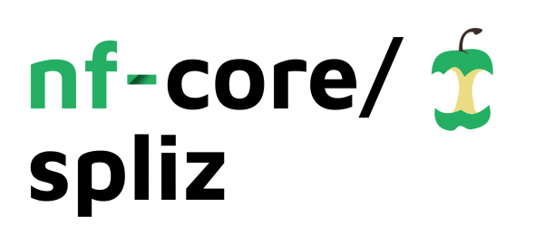

# 

**Code to calculate the Splicing Z Score (SZS) for single cell RNA-seq splicing analysis**.

[](https://github.com/nf-core/spliz/actions)
[](https://github.com/nf-core/spliz/actions)
[](https://www.nextflow.io/)

[](https://bioconda.github.io/)
[](https://hub.docker.com/r/nfcore/spliz)
[](https://nfcore.slack.com/channels/spliz)

## Introduction

<!-- TODO nf-core: Write a 1-2 sentence summary of what data the pipeline is for and what it does -->
**nf-core/spliz** is a bioinformatics best-practise analysis pipeline for calculating the splicing z-score for single cell RNA-seq analysis.

The pipeline is built using [Nextflow](https://www.nextflow.io), a workflow tool to run tasks across multiple compute infrastructures in a very portable manner. It comes with docker containers making installation trivial and results highly reproducible.

## Quick Start

1. Install [`nextflow`](https://nf-co.re/usage/installation) (`>=20.04.0`)

2. Install any of [`Docker`](https://docs.docker.com/engine/installation/), [`Singularity`](https://www.sylabs.io/guides/3.0/user-guide/), [`Podman`](https://podman.io/), [`Shifter`](https://nersc.gitlab.io/development/shifter/how-to-use/) or [`Charliecloud`](https://hpc.github.io/charliecloud/) for full pipeline reproducibility _(please only use [`Conda`](https://conda.io/miniconda.html) as a last resort; see [docs](https://nf-co.re/usage/configuration#basic-configuration-profiles))_

3. Download the pipeline and test it on a minimal dataset with a single command:

    ```bash
    nextflow run nf-core/spliz -profile test,<docker/singularity/podman/shifter/charliecloud/conda/institute>
    ```

    > Please check [nf-core/configs](https://github.com/nf-core/configs#documentation) to see if a custom config file to run nf-core pipelines already exists for your Institute. If so, you can simply use `-profile <institute>` in your command. This will enable either `docker` or `singularity` and set the appropriate execution settings for your local compute environment.

4. Start running your own analysis!

    <!-- TODO nf-core: Update the example "typical command" below used to run the pipeline -->

    ```bash
    nextflow run nf-core/spliz -profile <docker/singularity/podman/shifter/charliecloud/conda/institute> --input '*_R{1,2}.fastq.gz' --genome GRCh37
    ```

See [usage docs](https://nf-co.re/spliz/usage) for all of the available options when running the pipeline.

## Pipeline Summary

By default, the pipeline currently performs the following:
* Calculate the SpliZ scores for:
    * Identifying variable splice sites
    * Identifying differential splicing between cell types.

## Input Parameters

| Argument              | Description       |Example Usage  |
| --------------------- | ---------------- |-----------|
| `dataname`            | Descriptive name for SpliZ run        | "Tumor_5" |
| `run_analysis`        | If the pipeline will perform splice site identifcation and differential splicing analysis | `true`, `false` |
| `SICILIAN`            | If the input file is output from [SICILIAN](https://github.com/salzmanlab/SICILIAN) | `true`, `false` |
| `bam_dir`             | If `SICILIAN` = `false`, this path specifies the location of the input bam file | */home/data/* |
| `bam_samplesheet`     | If `SICILIAN` = `false`, this file specifies the locations of the input bam files. Samplesheet formatting is specified below. | *Tumor_5_samplesheet.csv* |
| `pin_S`               | Bound splice site residuals at this quantile (e.g. values in the lower `pin_S` quantile and the upper 1 - `pin_S` quantile will be rounded to the quantile limits) | 0.1 |
| `pin_z`               | Bound SpliZ scores at this quantile (e.g. values in the lower `pin_z` quantile and the upper 1 - `pin_z` quantile will be rounded to the quantile limits) | 0 |  
| `bounds`              | Only include cell/gene pairs that have more than this many junctional reads for the gene | 5 |
| `light`               | Only output the minimum number of columns | `true`, `false` |
| `svd_type`            | Type of SVD calculation | `normdonor`, `normgene` |
| `n_perms`             | Number of permutations | 100 |
| `grouping_level_1`    | Metadata column by which the data is intially partitioned  | "tissue" |
| `grouping_level_2`    | Metadata column by which the partitioned data is grouped | "compartment" |
| `libraryType`         | Library prepration method of the input data | `10X`, `SS2` |
| `annotator_pickle`    | [Genome-specific annotation file for gene names](https://github.com/salzmanlab/SICILIAN#annotator-and-index-files-needed-for-running-sicilian) | *hg38_refseq.pkl* |
| `exon_pickle`         | [Genome-specific annotation file for exon boundaries](https://github.com/salzmanlab/SICILIAN#annotator-and-index-files-needed-for-running-sicilian) | *hg38_refseq_exon_bounds.pkl* |
| `splice_pickle`       | [Genome-specific annotation file for splice sites](https://github.com/salzmanlab/SICILIAN#annotator-and-index-files-needed-for-running-sicilian) | *hg38_refseq_splices.pkl* |
| `gtf`                 | GTF file used as the reference annotation file for the genome assembly | *GRCh38_genomic.gtf* |
| `meta`                | If `SICILIAN` = `false`, this file contains per-cell annotations. This file must contain columns for `grouping_level_1` and `grouping_level_2`. | *metadata_tumor_5.tsv* |

### Samplesheets

The samplesheet must be in comma-separated value(CSV) format. The sampleID must be a unique identifier for each bam file or set of bam files.

Input files from 10X will have 2 columns: sampleID and bam file
```
Tumor_5_S1,tumor_5_S1_L001.bam
Tumor_5_S2,tumor_5_S1_L002.bam
Tumor_5_S3,tumor_5_S3_L002.bam
```

Input files from SS2 will have 3 columns: sampleID, R1 bam file, and R2 bam file
```
Tumor_5_S1,tumor_5_S1_L001.bam
Tumor_5_S2,tumor_5_S1_L002.bam
Tumor_5_S3,tumor_5_S3_L002.bam
```

## Documentation

The nf-core/spliz pipeline comes with documentation about the pipeline: [usage](https://nf-co.re/spliz/usage) and [output](https://nf-co.re/spliz/output).

<!-- TODO nf-core: Add a brief overview of what the pipeline does and how it works -->

## Credits

nf-core/spliz was originally written by Salzman Lab.

We thank the following people for their extensive assistance in the development
of this pipeline:

<!-- TODO nf-core: If applicable, make list of people who have also contributed -->

## Contributions and Support

If you would like to contribute to this pipeline, please see the [contributing guidelines](.github/CONTRIBUTING.md).

For further information or help, don't hesitate to get in touch on the [Slack `#spliz` channel](https://nfcore.slack.com/channels/spliz) (you can join with [this invite](https://nf-co.re/join/slack)).

## Citations

<!-- TODO nf-core: Add citation for pipeline after first release. Uncomment lines below and update Zenodo doi. -->
<!-- If you use  nf-core/spliz for your analysis, please cite it using the following doi: [10.5281/zenodo.XXXXXX](https://doi.org/10.5281/zenodo.XXXXXX) -->
This repositiory contains code to perform the analyses in this paper:

> **The SpliZ generalizes “Percent Spliced In” to reveal regulated splicing at single-cell resolution**
>
> Julia Eve Olivieri, Roozbeh Dehghannasiri, Julia Salzman.
>
> _bioRxiv_ 2021 Mar 31. doi: [10.1101/2020.11.10.377572](https://doi.org/10.1101/2020.11.10.377572).

You can cite the `nf-core` publication as follows:

> **The nf-core framework for community-curated bioinformatics pipelines.**
>
> Philip Ewels, Alexander Peltzer, Sven Fillinger, Harshil Patel, Johannes Alneberg, Andreas Wilm, Maxime Ulysse Garcia, Paolo Di Tommaso & Sven Nahnsen.
>
> _Nat Biotechnol._ 2020 Feb 13. doi: [10.1038/s41587-020-0439-x](https://dx.doi.org/10.1038/s41587-020-0439-x).


